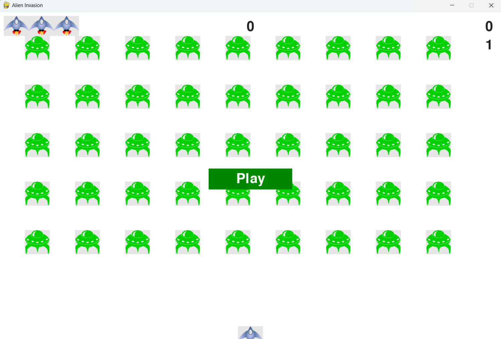

   # Alien Invasion


## Overview

Alien invasion is a 2D arcade-style game developed in Python using the Pygame library. This project was completed by following the Alien Invasion project from the book Python Crash Course (3rd Edition) by Eric Matthes as part of my Python learning journey.

The project introduced me to object-oriented programming, event-driven programming, game loops, and working with a multi-file Python project.


## Features

- Player-controlled spaceship
- Alien fleet generation
- Bullet firing
- Bullet and alien collision detection
- Multiple lives
- Score tracking
- High score tracking
- Level progression
- Increasing game difficulty
- Play button to restart the game
- Full-screen mode


## Technologies Used

- Python 3.13
- Pygame
- Visual Studio Code
- Git
- GitHub


## Project Structure

```text
alien_invasion/
|
|- alien_invasion.py
|- settings.py
|- ship.py
|- alien.py
|- bullet.py
|- button.py
|- game_stats.py
|- scoreboard.py
|- images/
|- README.md
```

## What I Learned

### Skills and Concepts Learned:

- Python classes and objects
- Object-oriented programming (OOP)
- Creating and using modules
- Working with methods and attributes
- Event handling with Pygame
- Keyboard and mouse input
- Game loops
- Collision detection
- Sprite groups
- Organizing code into multiple files
- Reading Python error messages and debugging


## Challenges Faced

### Challenges:

- Pygame installation issues with Python 3.14
- Debugging AttributeError and NameError
- Understanding object interactions between classes
- Fixing movement and collision logic
- Learning how Pygame sprites and groups work
- Refactoring code into helper methods for better organization

Solving these issues improved my understanding of Python debugging and project structure.


## Development Notes

While setting up the project, I initially used Python 3.14, but Pygame could not be installed successfully because a compatible package was not available for that version. Pip attempted to build Pygame from source, which failed during the download of required SDL libraries.


### To resolve the issue:

- I installed Python 3.13 alongside Python 3.14.
- I removed the original virtual environment.
- I created a new virtual environment using Python 3.13.
- I installed Pygame successfully in the new environment.


## How to Run

- Clone this repository.
- Create and activate a virtual environment.
- Install Pygame:

```bash
python -m pip install pygame
```
- Run the game:

```bash
python alien_invasion.py
```

## Acknowledgements

This project was developed by following the *Alien Invasion* project from the book **Python Crash Course (3rd Edition)** by **Eric Matthes**. I completed the project as part of my learning journey while gaining additional experience through debugging and problem-solving carried out during development.


## Future Improvements

### Some features I would like to explore in the future include:

- Sound effects and background music
- Animated explosions
- Additional enemy types
- Power-ups
- Pause menu
- Difficulty selection
- Saving the high score
- Improved game graphics


## License

This project is shared for learning and educational purposes.


## Screenshot




